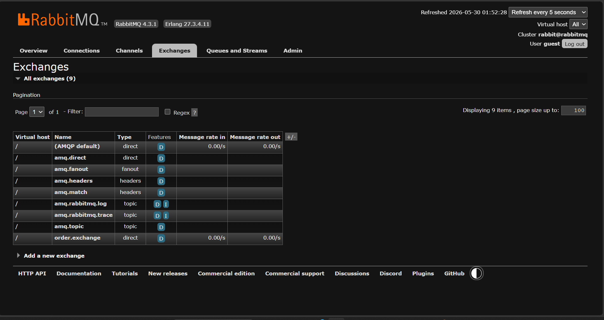
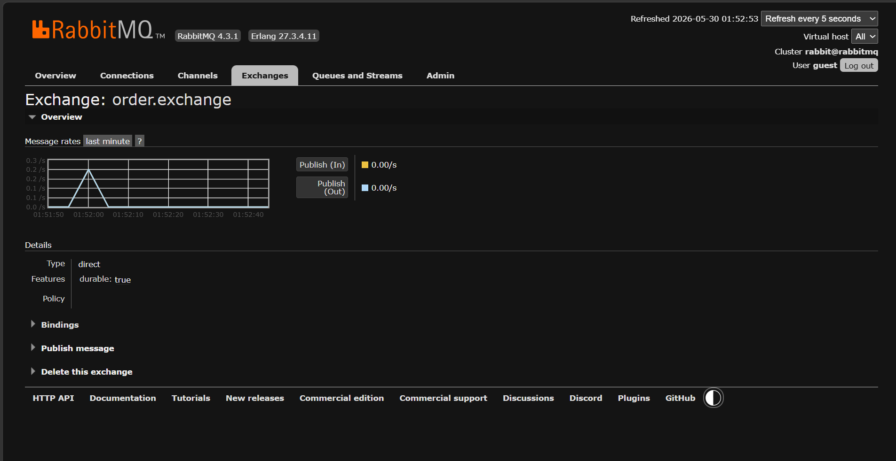
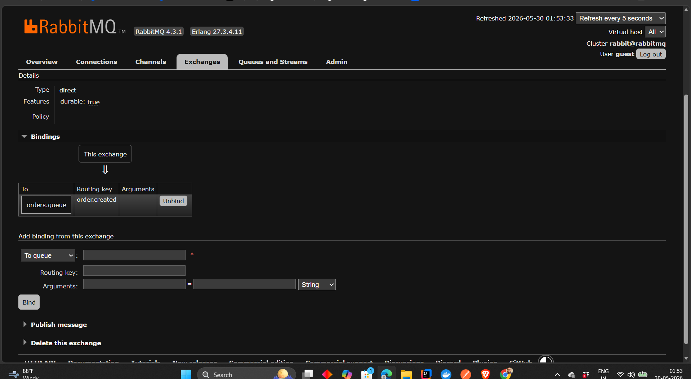

# Exchanges Deep Dive

## Learning Objectives

After completing this chapter, you will understand:

* What an Exchange is
* Why Exchanges exist
* Why Producers do not send messages directly to Queues
* How Exchanges route messages
* Exchange Lifecycle
* Bindings and Routing Keys
* Different Exchange Types
* How to create a Direct Exchange in Spring Boot
* How RabbitMQ routes messages internally

---

# The Problem Before Exchanges

In the previous chapter, we learned about Queues.

A Queue stores messages until Consumers process them.

At first glance, it may seem reasonable for Producers to send messages directly to Queues.

Example:

```text
Producer
    |
    +-----> orders.queue

Producer
    |
    +-----> notifications.queue

Producer
    |
    +-----> payments.queue
```

---

# Why Is This A Problem?

Imagine an E-Commerce system.

A Producer now needs to know:

* Queue names
* Queue locations
* Queue responsibilities

This creates tight coupling.

If a Queue changes:

```text
orders.queue
      ↓
order-processing.queue
```

The Producer must also change.

This violates one of the most important principles of distributed systems:

```text
Loose Coupling
```

---

# Without Exchange Architecture


Problems:

* Tight coupling
* Difficult maintenance
* Reduced scalability
* Producers become dependent on Queue details

---

# RabbitMQ Solution: Exchanges

RabbitMQ solves this problem using Exchanges.

An Exchange acts as a message router.

Instead of sending messages directly to Queues:

```text
Producer
    |
    V
Exchange
    |
    V
Queue
```

The Producer no longer needs to know where the message ultimately goes.

---

# Exchange Architecture


The Exchange sits between Producers and Queues.

Responsibilities:

* Receive messages
* Analyze routing information
* Decide where messages should go
* Forward messages to appropriate Queues

---

# What Is An Exchange?

An Exchange is a routing component inside RabbitMQ.

Think of it as a traffic controller.

Example:

```text
Airport Control Tower
         =
Exchange
```

The control tower decides:

```text
Which runway receives the aircraft
```

Similarly:

```text
Exchange decides
which Queue receives the message
```

---

# Exchange Routing Process


Message Journey:

```text
Producer
     |
     V

Message

     |
     V

Exchange

     |
Routing Decision

     |
     V

Queue
```

The Queue stores messages.

The Exchange routes messages.

This distinction is extremely important.

---

# Exchange Lifecycle

Every message follows this lifecycle:

```text
Producer
    |
    V

Exchange
    |
    V

Binding Evaluation
    |
    V

Routing Decision
    |
    V

Queue
    |
    V

Consumer
```

RabbitMQ performs this routing automatically.

---

# Exchange Types Overview

RabbitMQ provides multiple Exchange types.


---

## Direct Exchange

Routes messages based on exact Routing Key matches.

Example:

```text
order.created
```

Use Cases:

```text
Orders
Payments
Invoices
```

---

## Fanout Exchange

Routes messages to all connected Queues.

Routing Key ignored.

Use Cases:

```text
Notifications
Broadcast Events
Real-Time Updates
```

---

## Topic Exchange

Routes messages using patterns.

Example:

```text
order.*
payment.*
```

Use Cases:

```text
Microservices
Complex Event Routing
```

---

## Headers Exchange

Routes messages using Headers instead of Routing Keys.

Use Cases:

```text
Advanced Filtering
Specialized Enterprise Workloads
```

---

# Default Exchange

RabbitMQ automatically creates a special Exchange called:

```text
(default exchange)
```

When we previously used:

```java
rabbitTemplate.convertAndSend(
        queueName,
        message
);
```

RabbitMQ was actually using the Default Exchange behind the scenes.

This is why messages still reached the Queue.

Many developers do not realize this.

---

# Practical Implementation

In this chapter we created our first custom Exchange.

---

# Exchange Configuration

```java
@Configuration
public class ExchangeConfig {

    public static final String ORDER_EXCHANGE = "order.exchange";

    public static final String ORDER_ROUTING_KEY = "order.created";

    @Bean
    public DirectExchange orderExchange() {
        return new DirectExchange(
                ORDER_EXCHANGE,
                true,
                false
        );
    }
}
```

---

# What Does This Create?

RabbitMQ creates:

```text
order.exchange
```

Type:

```text
Direct Exchange
```

Durability:

```text
Durable
```

This Exchange survives RabbitMQ restarts.

---

# Understanding The Constructor

```java
new DirectExchange(
    "order.exchange",
    true,
    false
)
```

Meaning:

| Parameter      | Purpose              |
| -------------- | -------------------- |
| order.exchange | Exchange Name        |
| true           | Durable              |
| false          | Auto Delete Disabled |

---

# Creating A Binding

Queues do not automatically receive messages.

An Exchange must be connected to a Queue.

This connection is called a Binding.

Example:

```java
@Bean
public Binding orderBinding(
        Queue ordersQueue,
        DirectExchange orderExchange
) {

    return BindingBuilder
            .bind(ordersQueue)
            .to(orderExchange)
            .with("order.created");
}
```

---

# What Is Happening?

RabbitMQ creates:

```text
order.exchange
       |
(order.created)
       |
orders.queue
```

Now RabbitMQ knows:

```text
Messages with routing key
"order.created"

should go to

orders.queue
```

---

# Routing Key

A Routing Key is metadata attached to a message.

Example:

```text
order.created
```

Routing Keys help Exchanges decide:

```text
Which Queue receives the message
```

We will explore Routing Keys in depth later.

For now:

```text
Routing Key = Message Address
```

is a good mental model.

---

# Updating The Producer

Previously:

```java
rabbitTemplate.convertAndSend(
        QueueConfig.ORDERS_QUEUE,
        message
);
```

Producer directly targeted the Queue.

---

Now:

```java
rabbitTemplate.convertAndSend(
        ExchangeConfig.ORDER_EXCHANGE,
        ExchangeConfig.ORDER_ROUTING_KEY,
        message
);
```

Producer targets:

```text
Exchange
+
Routing Key
```

RabbitMQ handles the rest.

---

# Message Flow

Our application now behaves like this:

```text
Producer
    |
    V

order.exchange

    |
(order.created)

    |
    V

orders.queue

    |
    V

Consumer
```

This is how RabbitMQ is designed to operate.

---

# Verifying In RabbitMQ UI

Open:

```text
http://localhost:15672
```

Login:

```text
guest
guest
```

Navigate to:

```text
Exchanges
```

---

# Exchange Created



RabbitMQ now contains:

```text
order.exchange
```

---

# Exchange Details



Important Information:

* Exchange Name
* Exchange Type
* Durability
* Auto Delete Status

---

# Binding Verification



RabbitMQ shows:

```text
order.exchange
      |
(order.created)
      |
orders.queue
```

This confirms successful routing configuration.

---

# Real World Example

Consider an E-Commerce Platform.

When an Order is created:

```text
Order Service
       |
       V

order.exchange

       |
(order.created)

       |
       V

orders.queue
```

Later:

```text
analytics.queue
audit.queue
notifications.queue
```

can be added without changing the Producer.

This is the power of Exchanges.

---

# Exchange Best Practices

## Use Meaningful Names

Good:

```text
order.exchange
payment.exchange
notification.exchange
```

Bad:

```text
exchange1
exchange2
```

---

## Keep Exchanges Focused

One Exchange should represent one business domain.

Examples:

```text
order.exchange
payment.exchange
inventory.exchange
```

---

## Use Durable Exchanges

For production systems:

```java
new DirectExchange(
        "order.exchange",
        true,
        false
);
```

Always prefer durable Exchanges.

---

## Separate Routing Logic

Producers should know:

```text
Exchange
Routing Key
```

They should not know:

```text
Queue Details
```

---

# Key Takeaways

* Exchanges are message routers.
* Producers send messages to Exchanges.
* Exchanges route messages to Queues.
* Queues store messages.
* Bindings connect Exchanges and Queues.
* Routing Keys help Exchanges make routing decisions.
* RabbitMQ supports multiple Exchange types.
* Direct Exchange uses exact Routing Key matching.

---

# Interview Questions

### 1. What is an Exchange in RabbitMQ?

### 2. Why do Exchanges exist?

### 3. What is the difference between a Queue and an Exchange?

### 4. What is a Binding?

### 5. What is a Routing Key?

### 6. What is a Direct Exchange?

### 7. What is the Default Exchange?

### 8. Why should Producers not send messages directly to Queues?

### 9. What are the four Exchange types?

### 10. How does RabbitMQ route messages?

### 11. What is the purpose of a Binding?

### 12. Explain the complete message flow in RabbitMQ.

---

# Chapter Summary

In this chapter, we explored Exchanges, the routing engine of RabbitMQ.

We learned:

* Why Exchanges exist
* How Exchanges solve tight coupling
* Exchange lifecycle
* Exchange types
* Bindings
* Routing Keys
* Direct Exchange implementation using Spring Boot

Most importantly, we learned the core RabbitMQ architecture:

```text
Producer
    |
    V

Exchange
    |
    V

Queue
    |
    V

Consumer
```

This architecture forms the foundation for all advanced RabbitMQ messaging patterns.

---

# What's Next?

### Next Chapter → Bindings

Topics Covered:

* What Is A Binding?
* Binding Lifecycle
* Exchange-To-Queue Relationships
* Multiple Bindings
* Binding Patterns
* RabbitMQ Binding Internals
* Real World Binding Examples
* Spring Boot Binding Configuration

```
```
