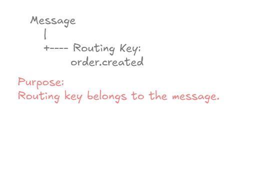
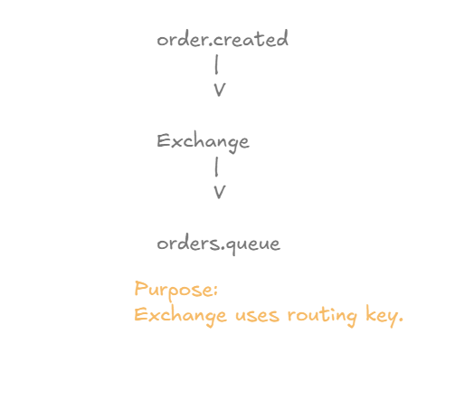
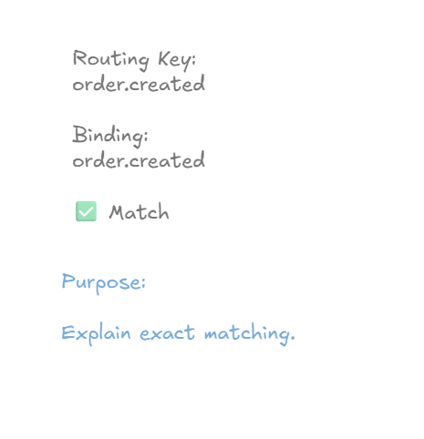
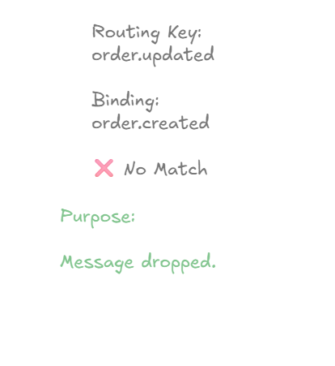
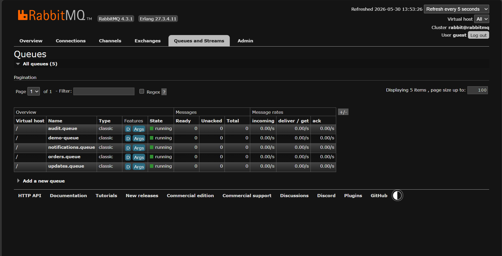
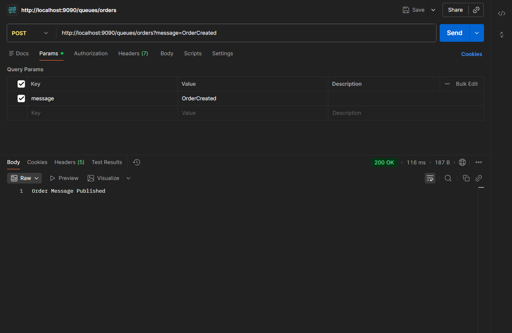
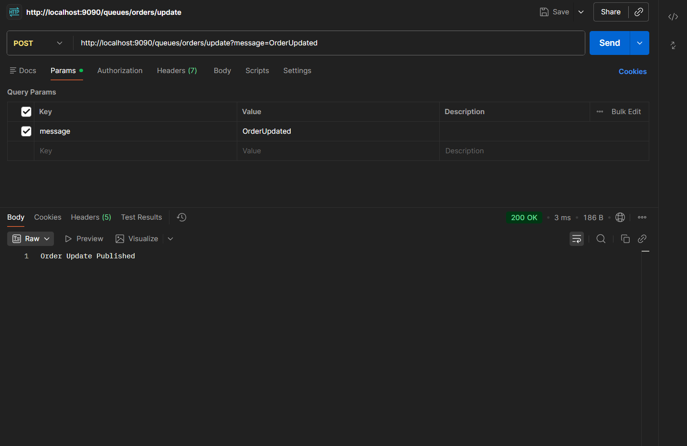
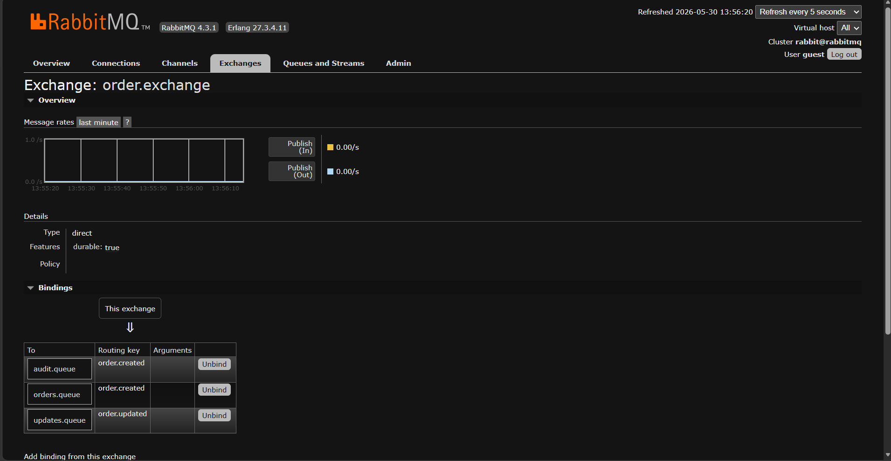
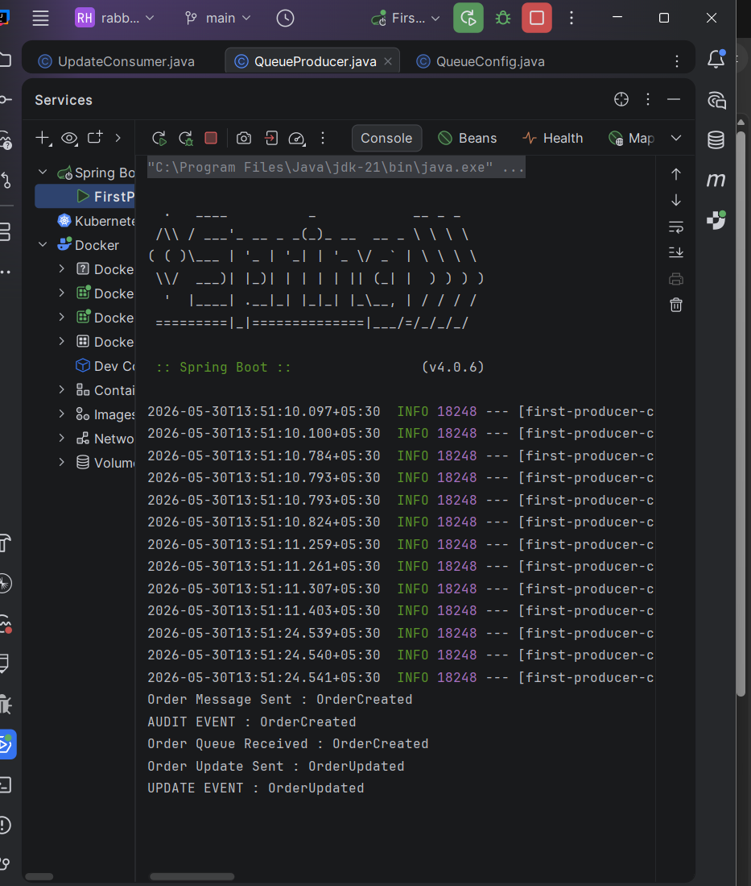

# Routing Keys Deep Dive

## Learning Objectives

After completing this chapter, you will understand:

* What a Routing Key is
* Why Routing Keys exist
* How RabbitMQ uses Routing Keys
* Exact Match Routing
* Routing Key Mismatches
* Message Classification
* Multiple Routing Keys
* Routing Key Best Practices
* How Routing Keys work with Direct Exchanges
* Production-grade Routing Strategies

---

# Recap From Previous Chapters

So far we have learned:

```text
Producer
    |
    V

Exchange
    |
 Binding
    |
    V

Queue
    |
    V

Consumer
```

We learned:

* Exchanges route messages
* Bindings connect Exchanges and Queues
* Queues store messages

But one question still remains:

**How does RabbitMQ decide which Queue should receive a message?**

The answer is:

```text
Routing Key
```

---

# What Is A Routing Key?

A Routing Key is a piece of metadata attached to a message.

RabbitMQ uses this metadata to determine where the message should be routed.

Think of a Routing Key as a postal address.

Example:

```text
order.created
```

The Exchange reads this value and decides which Queue should receive the message.

---

# Message With Routing Key



Every message can carry a Routing Key.

Example:

```text
Message
    |
    +---- Routing Key:
          order.created
```

The Routing Key travels with the message.

---

# Why Routing Keys Exist

Imagine an Exchange receiving thousands of messages.

Without Routing Keys:

```text
RabbitMQ has no way to distinguish messages.
```

Examples:

```text
Order Created
Order Updated
Order Cancelled
Payment Completed
Payment Failed
```

All messages would look identical.

Routing Keys allow RabbitMQ to classify messages.

---

# Routing Key As Message Classification

Think of Routing Keys as message categories.

Examples:

```text
order.created
order.updated
order.cancelled
payment.completed
payment.failed
```

RabbitMQ uses these categories to route messages.

---

# Exchange Routing Decision



Message Flow:

```text
Producer
     |
Routing Key:
order.created
     |
     V

Exchange
     |
Routing Decision
     |
     V

Queue
```

The Exchange examines the Routing Key before forwarding the message.

---

# Exact Match Routing

A Direct Exchange performs:

```text
Exact Matching
```

This means:

```text
Routing Key
      =
Binding Key
```

must be identical.

---

# Routing Key Match



Example:

```text
Routing Key:
order.created

Binding:
order.created
```

Result:

```text
MATCH
```

RabbitMQ routes the message.

---

# Routing Key Mismatch



Example:

```text
Routing Key:
order.updated

Binding:
order.created
```

Result:

```text
NO MATCH
```

RabbitMQ does not route the message to that Queue.

This is one of the most important RabbitMQ concepts.

---

# Multiple Routing Keys


RabbitMQ can work with many Routing Keys.

Example:

```text
order.created
order.updated
order.cancelled
```

Each key can represent a different business event.

---

# Practical Implementation

In this chapter we extended our application.

Previously:

```text
order.exchange
       |
(order.created)
       |
       +---- orders.queue
       |
       +---- audit.queue
```

Now:

```text
order.exchange

       |
       +---- order.created
       |
       |       +---- orders.queue
       |       |
       |       +---- audit.queue
       |
       +---- order.updated
               |
               +---- updates.queue
```

RabbitMQ now makes routing decisions based on Routing Keys.

---

# Creating Updates Queue

Queue Configuration:

```java
@Bean
public Queue updatesQueue() {
    return new Queue("updates.queue", true);
}
```

RabbitMQ creates:

```text
updates.queue
```

during application startup.

---

# Creating A New Routing Key

Exchange Configuration:

```java
public static final String ORDER_UPDATED_KEY =
        "order.updated";
```

This Routing Key represents:

```text
Order Updated Event
```

---

# Binding Updates Queue

```java
@Bean
public Binding updatesBinding(
        Queue updatesQueue,
        DirectExchange orderExchange
) {

    return BindingBuilder
            .bind(updatesQueue)
            .to(orderExchange)
            .with(ORDER_UPDATED_KEY);
}
```

RabbitMQ now knows:

```text
order.updated
        ↓
updates.queue
```

---

# Update Consumer

```java
@RabbitListener(
        queues = QueueConfig.UPDATES_QUEUE
)
public void consumeUpdateMessage(
        String message
) {

    System.out.println(
            "UPDATE EVENT : " + message
    );
}
```

This Consumer only processes update events.

---

# Queue Verification

## Updates Queue Created



RabbitMQ now contains:

```text
orders.queue
audit.queue
updates.queue
```

---

# Routing Key: order.created

API:

```http
POST /queues/orders?message=OrderCreated
```

Response:

```text
Order Message Published
```



Routing Key:

```text
order.created
```

RabbitMQ routes the message to:

```text
orders.queue
audit.queue
```

---

# Routing Key: order.updated

API:

```http
POST /queues/orders/update?message=OrderUpdated
```

Response:

```text
Order Update Published
```



Routing Key:

```text
order.updated
```

RabbitMQ routes the message to:

```text
updates.queue
```

---

# Binding Verification



RabbitMQ shows:

```text
order.created
       |
       +---- orders.queue

       +---- audit.queue

order.updated
       |
       +---- updates.queue
```

This proves Routing Keys drive routing decisions.

---

# Routing Key Based Consumption



Console Output:

```text
Order Queue Received : OrderCreated

AUDIT EVENT : OrderCreated

UPDATE EVENT : OrderUpdated
```

This demonstrates:

```text
Different Routing Keys
        ↓
Different Consumers
```

---

# Real World Example

Consider Amazon.

Order Created:

```text
order.created
```

Consumers:

```text
Order Service
Audit Service
Analytics Service
```

Order Updated:

```text
order.updated
```

Consumers:

```text
Inventory Service
Notification Service
```

Order Cancelled:

```text
order.cancelled
```

Consumers:

```text
Refund Service
Customer Service
```

Routing Keys allow a single Exchange to intelligently route events.

---

# Production Routing Key Naming Convention

Recommended:

```text
domain.action
```

Examples:

```text
order.created
order.updated
order.cancelled

payment.completed
payment.failed

inventory.low
```

Avoid:

```text
event1
event2
abc
test
```

---

# Routing Key Best Practices

### Use Business-Oriented Names

Good:

```text
payment.completed
```

Bad:

```text
payment123
```

### Use Consistent Patterns

Recommended:

```text
domain.action
```

Example:

```text
order.created
order.updated
order.deleted
```

### Avoid Generic Routing Keys

Bad:

```text
event
message
data
```

Good:

```text
invoice.generated
payment.failed
shipment.dispatched
```

### Maintain An Event Catalog

In production systems maintain documentation containing:

```text
Routing Key
Producer
Consumer
Description
```

This becomes critical when dozens of microservices exist.

---

# Key Takeaways

* Routing Keys classify messages.
* Exchanges use Routing Keys to make routing decisions.
* Direct Exchanges use exact matching.
* Routing Key and Binding Key must match.
* Different Routing Keys can route messages to different Queues.
* Routing Keys are the foundation of intelligent RabbitMQ routing.
* Well-designed Routing Keys improve maintainability and scalability.

---

# Interview Questions

1. What is a Routing Key in RabbitMQ?
2. Why are Routing Keys required?
3. How does a Direct Exchange use Routing Keys?
4. What happens when a Routing Key does not match?
5. What is Exact Match Routing?
6. Can multiple Queues use the same Routing Key?
7. Can a single Exchange handle multiple Routing Keys?
8. What naming convention should be used for Routing Keys?
9. Explain the complete routing process in RabbitMQ.
10. What is the relationship between Routing Keys and Bindings?
11. How do Routing Keys help in Event-Driven Architecture?
12. What happens when a message has no matching Binding?

---

# Chapter Summary

In this chapter, we explored Routing Keys, the mechanism RabbitMQ uses to make routing decisions.

We learned:

* What Routing Keys are
* Why Routing Keys exist
* Exact Match Routing
* Routing Key Mismatches
* Message Classification
* Multiple Routing Keys
* Production-grade Routing Strategies

Most importantly, we completed the RabbitMQ routing model:

```text
Producer
    |
Routing Key
    |
    V

Exchange
    |
 Binding
    |
    V

Queue
    |
    V

Consumer
```

This architecture is the foundation of modern event-driven systems and microservice communication.

---

# What's Next?

## Next Chapter → Direct Exchange Deep Dive

Topics Covered:

* Direct Exchange Internals
* Exact Match Routing
* Multiple Routing Keys
* Multiple Consumers
* Routing Strategies
* Production Design Considerations
* Spring Boot Direct Exchange Implementation
* Real World Direct Exchange Patterns
