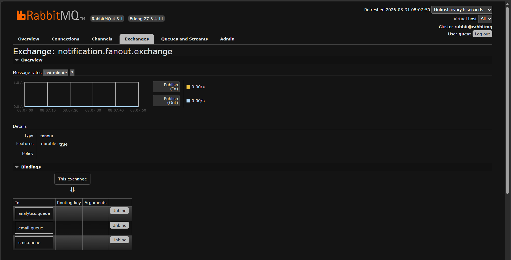

# Fanout Exchange Deep Dive

## Learning Objectives

After completing this chapter, you will understand:

* What a Fanout Exchange is
* Why Fanout Exchanges exist
* Broadcast Messaging
* How Fanout Exchanges route messages
* Why Routing Keys are ignored
* Fanout Exchange Message Flow
* Direct Exchange vs Fanout Exchange
* Real-World Use Cases
* Production Best Practices
* Spring Boot Fanout Exchange Implementation

---

# Recap From Previous Chapter

In the previous chapter, we learned about:

```text
Direct Exchange
```

Direct Exchanges use:

```text
Routing Key
```

to determine where a message should go.

Example:

```text
order.created
```

might route to:

```text
orders.queue
audit.queue
```

while:

```text
order.updated
```

routes to:

```text
updates.queue
```

This is called:

```text
Selective Routing
```

---

# What Is A Fanout Exchange?

A Fanout Exchange broadcasts every message to all connected queues.

Unlike Direct Exchanges:

```text
Fanout Exchange
```

does not care about:

```text
Routing Keys
```

Every bound queue receives the message.

---

# Fanout Exchange Overview


Message Flow:

```text
Producer
     |
     V

Fanout Exchange
     |
     +---- Queue A

     +---- Queue B

     +---- Queue C
```

Every queue receives a copy.

---

# Why Fanout Exchange Exists

Imagine:

```text
User Registered
```

event occurs.

Multiple systems need this event:

```text
Email Service

SMS Service

Analytics Service

Audit Service
```

Should the producer send messages separately?

```text
NO
```

RabbitMQ can broadcast the event automatically.

---

# Broadcast Messaging

Fanout Exchanges are designed for:

```text
One Message

↓

Many Consumers
```

This is known as:

```text
Event Broadcasting
```

---

# Broadcast Message Flow


Example:

```text
UserRegistered
```

enters:

```text
notification.fanout.exchange
```

and RabbitMQ distributes it to:

```text
email.queue

sms.queue

analytics.queue
```

simultaneously.

---

# Routing Key Is Ignored

One of the most important concepts.

Fanout Exchange ignores:

```text
Routing Key
```

completely.

---

# Routing Key Ignored


These messages behave exactly the same:

```text
order.created

payment.failed

xyz

anything
```

Because Fanout Exchange does not inspect routing keys.

---

# Direct Exchange vs Fanout Exchange


| Direct Exchange     | Fanout Exchange     |
| ------------------- | ------------------- |
| Uses Routing Key    | Ignores Routing Key |
| Exact Match Routing | Broadcast Routing   |
| Selective Delivery  | Deliver To All      |
| Smart Routing       | Mass Distribution   |
| Event Filtering     | Event Broadcasting  |

---

# Practical Implementation

In this chapter we implemented:

```text
notification.fanout.exchange
```

along with:

```text
email.queue

sms.queue

analytics.queue
```

---

# Final Architecture

```text
notification.fanout.exchange

           |
           +---- email.queue

           |
           +---- sms.queue

           |
           +---- analytics.queue
```

Every queue receives the same message.

---

# Creating Fanout Exchange

Configuration:

```java
@Bean
public FanoutExchange notificationExchange() {

    return new FanoutExchange(
            "notification.fanout.exchange"
    );
}
```

This creates:

```text
notification.fanout.exchange
```

during startup.

---

# Creating Queues

Configuration:

```java
@Bean
public Queue emailQueue() {
    return new Queue("email.queue", true);
}

@Bean
public Queue smsQueue() {
    return new Queue("sms.queue", true);
}

@Bean
public Queue analyticsQueue() {
    return new Queue("analytics.queue", true);
}
```

RabbitMQ automatically creates all queues.

---

# Creating Bindings

Bindings:

```java
@Bean
public Binding emailBinding(
        Queue emailQueue,
        FanoutExchange exchange
) {

    return BindingBuilder
            .bind(emailQueue)
            .to(exchange);
}
```

Notice:

```java
.with(...)
```

does not exist.

Fanout Exchange does not need Routing Keys.

---

# Email Consumer

```java
@RabbitListener(
        queues = "email.queue"
)
public void consumeEmail(
        String message
) {

    System.out.println(
            "EMAIL SERVICE : " + message
    );
}
```

---

# SMS Consumer

```java
@RabbitListener(
        queues = "sms.queue"
)
public void consumeSms(
        String message
) {

    System.out.println(
            "SMS SERVICE : " + message
    );
}
```

---

# Analytics Consumer

```java
@RabbitListener(
        queues = "analytics.queue"
)
public void consumeAnalytics(
        String message
) {

    System.out.println(
            "ANALYTICS SERVICE : " + message
    );
}
```

---

# Publishing A Notification

Producer:

```java
rabbitTemplate.convertAndSend(
        "notification.fanout.exchange",
        "",
        message
);
```

Notice:

```java
""
```

Empty Routing Key.

This demonstrates the core behavior of Fanout Exchange.

---

# Exchange Verification

## Fanout Exchange Created


RabbitMQ shows:

```text
notification.fanout.exchange
```

created successfully.

---

# Queue Verification

## Email Queue


---

## SMS Queue


---

## Analytics Queue


All queues are connected to the Fanout Exchange.

---

# Publishing Event

API Request:

```http
POST /notifications?message=UserRegistered
```

Response:

```text
Notification Published Successfully
```

---


RabbitMQ receives the event and broadcasts it.

---

# Binding Verification



RabbitMQ shows:

```text
notification.fanout.exchange
           |
           +---- email.queue

           +---- sms.queue

           +---- analytics.queue
```

This proves broadcast configuration.

---

# Consumer Verification


Console Output:

```text
EMAIL SERVICE : UserRegistered

SMS SERVICE : UserRegistered

ANALYTICS SERVICE : UserRegistered
```

One message produced:

```text
Three Consumers Executed
```

---

# Message Journey

Step 1:

```text
UserRegistered
```

event created.

---

Step 2:

Producer sends message.

---

Step 3:

Fanout Exchange receives message.

---

Step 4:

RabbitMQ ignores Routing Key.

---

Step 5:

Message copied to:

```text
email.queue

sms.queue

analytics.queue
```

---

Step 6:

All consumers process the event.

---

# Real World Notification System


User registration occurs.

RabbitMQ broadcasts event to:

```text
Email Service

SMS Service

Analytics Service

Audit Service
```

without the producer knowing about any of them.

This is a major advantage of Event-Driven Architecture.

---

# Production Use Cases

Fanout Exchanges are commonly used for:

### Notification Systems

```text
Email Notifications

SMS Notifications

Push Notifications
```

---

### Analytics Pipelines

```text
User Events

Product Events

Tracking Events
```

---

### Audit Logging

```text
User Actions

Payment Events

Security Events
```

---

### Monitoring Systems

```text
System Events

Health Events

Operational Metrics
```

---

### Microservice Broadcasting

```text
One Event

↓

Multiple Services
```

---

# Fanout Exchange Best Practices

## Use For Broadcast Events

Good:

```text
UserRegistered

OrderCreated

PaymentCompleted
```

---

## Keep Exchange Purpose Clear

Good:

```text
notification.fanout.exchange

audit.fanout.exchange
```

Avoid:

```text
everything.exchange
```

---

## Avoid Unnecessary Consumers

Every bound queue receives a copy.

Only bind queues that truly need the event.

---

## Monitor Message Volume

Fanout can multiply traffic quickly.

Example:

```text
1 Message

↓

10 Queues

↓

10 Delivered Messages
```

Monitor growth carefully.

---

# Direct Exchange vs Fanout Exchange

Use Direct Exchange when:

```text
Specific Queue Must Receive Event
```

Examples:

```text
order.updated

payment.failed
```

---

Use Fanout Exchange when:

```text
Everyone Must Receive Event
```

Examples:

```text
UserRegistered

SystemStarted

ApplicationShutdown
```

---

# Key Takeaways

* Fanout Exchange broadcasts messages.
* Routing Keys are ignored.
* Every bound queue receives a copy.
* One message can trigger multiple consumers.
* Fanout is ideal for event broadcasting.
* Commonly used in notifications, analytics, monitoring, and audit systems.
* Fanout Exchanges simplify microservice communication.

---

# Interview Questions

### 1. What is a Fanout Exchange?

### 2. How does Fanout Exchange route messages?

### 3. Does Fanout Exchange use Routing Keys?

### 4. Why are Routing Keys ignored?

### 5. What is the difference between Direct and Fanout Exchange?

### 6. Can one message reach multiple queues?

### 7. What are common production use cases?

### 8. Explain Fanout Exchange message flow.

### 9. When would you use Fanout instead of Direct Exchange?

### 10. What are the drawbacks of Fanout Exchange?

---

# Chapter Summary

In this chapter, we explored Fanout Exchanges.

We learned:

* Fanout Exchange fundamentals
* Broadcast Messaging
* Routing Key behavior
* Direct vs Fanout comparison
* Spring Boot implementation
* Real-world notification systems
* Production best practices

Most importantly, we demonstrated:

```text
One Event

↓

Multiple Queues

↓

Multiple Consumers
```

which is one of the most powerful messaging patterns used in modern event-driven architectures.

---

# What's Next?

## Next Chapter → Topic Exchange

Topics Covered:

* Wildcard Routing
* Pattern Matching
* * (Single Word Wildcard)
* # (Multi Word Wildcard)
* Flexible Routing Strategies
* Advanced Event Classification
* Real-World Topic Routing Patterns

Topic Exchange is the most powerful and most widely used RabbitMQ Exchange type in large-scale systems.
