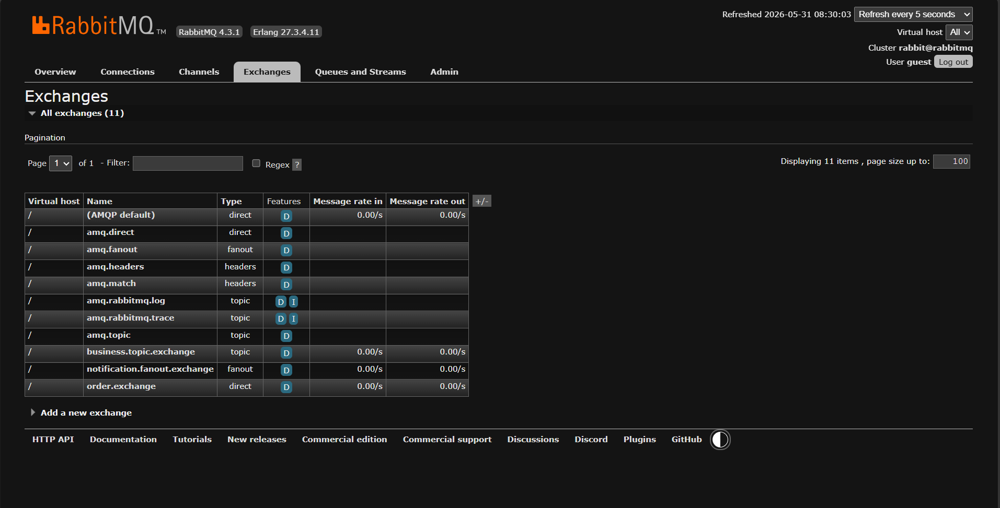
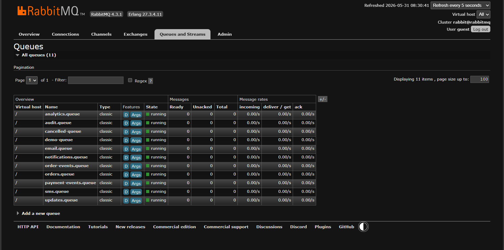
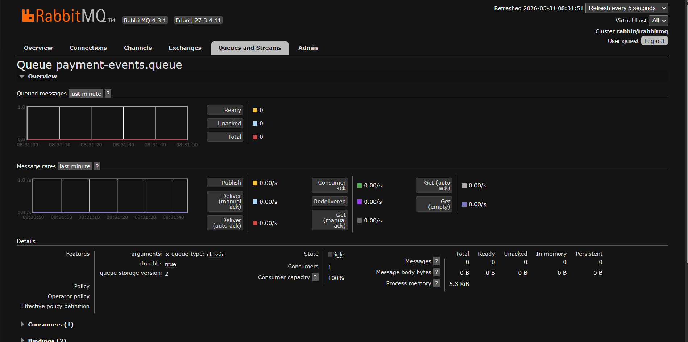
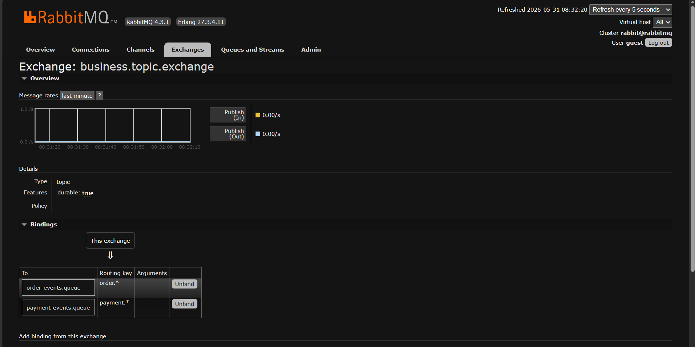
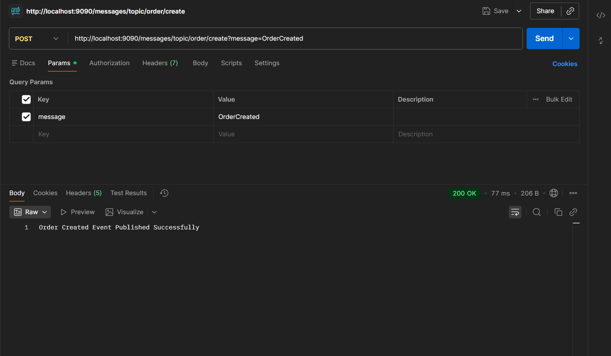
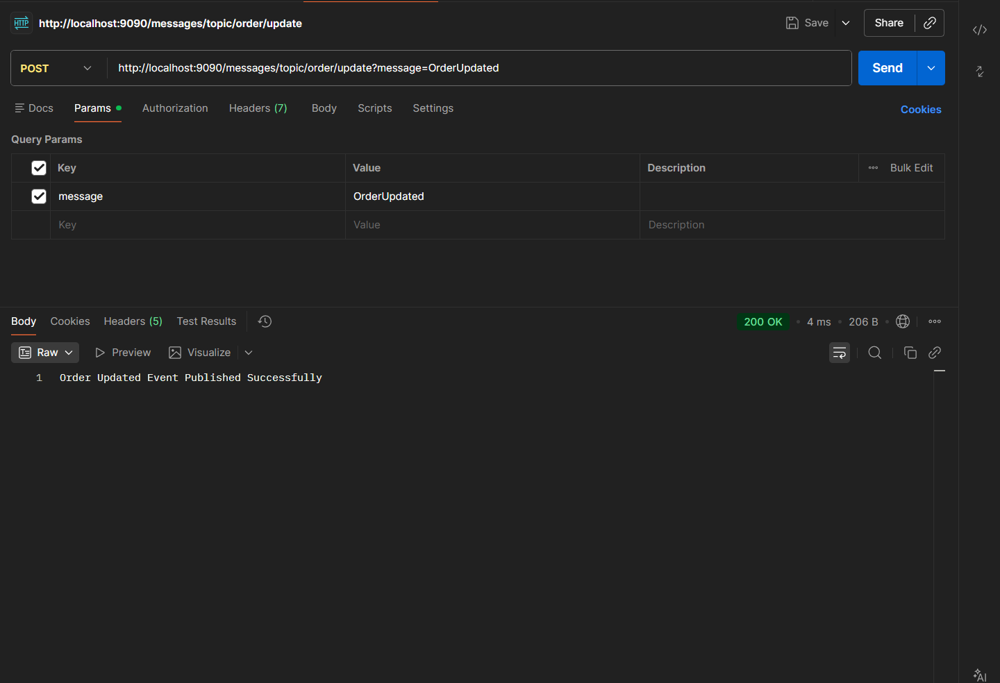
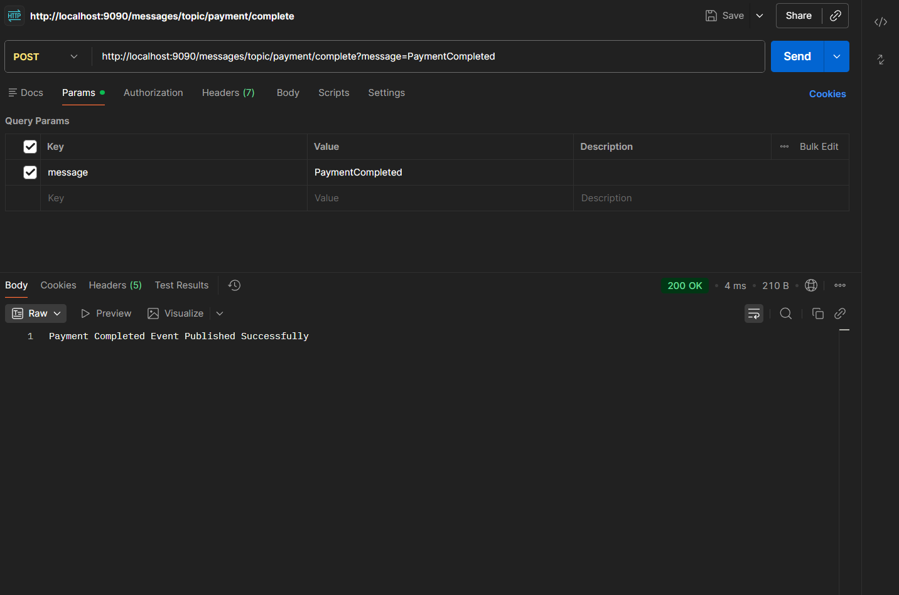
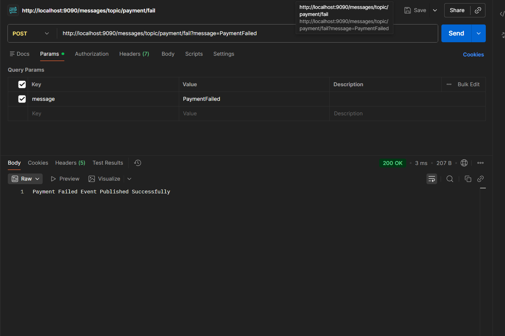
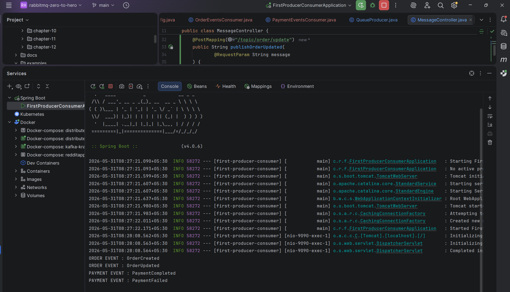

# Topic Exchange Deep Dive

## Learning Objectives

After completing this chapter, you will understand:

* What a Topic Exchange is
* Why Topic Exchanges exist
* Pattern-Based Routing
* Wildcard Routing
* `*` (Single Word Wildcard)
* `#` (Multi Word Wildcard)
* Topic Exchange Routing Logic
* Topic Exchange vs Direct Exchange
* Real-World Routing Strategies
* Spring Boot Topic Exchange Implementation

---

# Recap From Previous Chapters

We have already explored:

```text
Direct Exchange
    ↓
Exact Match Routing

Fanout Exchange
    ↓
Broadcast Routing
```

Direct Exchange example:

```text
order.created
```

must match:

```text
order.created
```

exactly.

Fanout Exchange:

```text
Routing Key Ignored
```

and every queue receives the message.

Now we move to RabbitMQ's most powerful exchange type:

```text
Topic Exchange
```

---

# What Is A Topic Exchange?

A Topic Exchange routes messages based on:

```text
Pattern Matching
```

Instead of exact matching.

Example:

Binding:

```text
order.*
```

Matches:

```text
order.created
order.updated
order.cancelled
```

RabbitMQ evaluates the routing key against a pattern.

---

# Topic Exchange Overview


Message Flow:

```text
Producer
     |
     V

Topic Exchange

     |
     +---- order.*

     |
     +---- payment.*

     |
     +---- inventory.*
```

This enables flexible routing.

---

# Why Topic Exchange Exists

Imagine an E-Commerce system.

Events:

```text
order.created
order.updated
order.cancelled
order.shipped
order.delivered
```

Using Direct Exchange:

```text
Need 5 Bindings
```

Using Topic Exchange:

```text
order.*
```

One binding handles everything.

---

# Single Word Wildcard (*)

The asterisk matches:

```text
Exactly One Word
```

Example:

Binding:

```text
order.*
```

Matches:

```text
order.created
order.updated
order.cancelled
```

Does NOT Match:

```text
order.eu.created
```

---

# Single Word Wildcard Example


---

# Multi Word Wildcard (#)

The hash wildcard matches:

```text
Zero Or More Words
```

Example:

Binding:

```text
order.#
```

Matches:

```text
order.created
order.eu.created
order.india.shipped
order.anything.anything
```

---

# Multi Word Wildcard Example


---

# Topic Routing Example


Example:

```text
order.created
        ↓
order-events.queue

payment.completed
        ↓
payment-events.queue
```

---

# Direct Exchange vs Topic Exchange


| Direct Exchange | Topic Exchange      |
| --------------- | ------------------- |
| Exact Match     | Pattern Match       |
| No Wildcards    | Supports Wildcards  |
| Less Flexible   | Highly Flexible     |
| Simple Routing  | Advanced Routing    |
| Fastest Option  | Most Popular Option |

---

# Practical Implementation

In this chapter we implemented:

```text
business.topic.exchange
```

along with:

```text
order-events.queue

payment-events.queue
```

---

# Final Architecture

```text
business.topic.exchange

      |
      +---- order.*
      |          |
      |          +---- order-events.queue
      |
      +---- payment.*
                 |
                 +---- payment-events.queue
```

---

# Creating Topic Exchange

```java
@Bean
public TopicExchange businessTopicExchange() {

    return new TopicExchange(
            "business.topic.exchange"
    );
}
```

---

# Creating Queues

```java
@Bean
public Queue orderEventsQueue() {
    return new Queue(
            "order-events.queue",
            true
    );
}

@Bean
public Queue paymentEventsQueue() {
    return new Queue(
            "payment-events.queue",
            true
    );
}
```

---

# Creating Topic Bindings

```java
@Bean
public Binding orderTopicBinding(
        Queue queue,
        TopicExchange exchange
) {

    return BindingBuilder
            .bind(queue)
            .to(exchange)
            .with("order.*");
}
```

```java
@Bean
public Binding paymentTopicBinding(
        Queue queue,
        TopicExchange exchange
) {

    return BindingBuilder
            .bind(queue)
            .to(exchange)
            .with("payment.*");
}
```

---

# Exchange Verification

## Topic Exchange Created



---

## Order Events Queue



---

## Payment Events Queue



---

# Binding Verification



RabbitMQ shows:

```text
order.*
       ↓
order-events.queue

payment.*
       ↓
payment-events.queue
```

---

# Testing Order Created Event

API:

```http
POST /messages/topic/order/create?message=OrderCreated
```



---

# Testing Order Updated Event

API:

```http
POST /messages/topic/order/update?message=OrderUpdated
```



---

# Testing Payment Completed Event

API:

```http
POST /messages/topic/payment/complete?message=PaymentCompleted
```



---

# Testing Payment Failed Event

API:

```http
POST /messages/topic/payment/fail?message=PaymentFailed
```



---

# Consumer Verification



Console Output:

```text
ORDER EVENT : OrderCreated

ORDER EVENT : OrderUpdated

PAYMENT EVENT : PaymentCompleted

PAYMENT EVENT : PaymentFailed
```

---

# Real World E-Commerce Example


Order Service:

```text
order.created
order.updated
order.cancelled
```

Binding:

```text
order.*
```

Payment Service:

```text
payment.completed
payment.failed
```

Binding:

```text
payment.*
```

---

# Production Use Cases

### E-Commerce Platforms

```text
order.*
payment.*
shipment.*
```

### Banking Systems

```text
transaction.*
account.*
fraud.*
```

### Logistics Platforms

```text
shipment.*
warehouse.*
delivery.*
```

### SaaS Platforms

```text
user.*
subscription.*
invoice.*
```

---

# Topic Exchange Best Practices

## Use Domain-Based Routing

Good:

```text
order.created
order.updated
payment.completed
```

Bad:

```text
event1
abc
test
```

---

## Prefer Consistent Naming

Recommended:

```text
domain.action
```

Examples:

```text
order.created
payment.completed
shipment.delivered
```

---

## Use Wildcards Carefully

Good:

```text
order.*
```

Avoid:

```text
#
```

unless absolutely necessary.

---

# Key Takeaways

* Topic Exchange uses pattern matching.
* `*` matches exactly one word.
* `#` matches zero or more words.
* Topic Exchange is more flexible than Direct Exchange.
* Topic Exchange is one of the most widely used RabbitMQ exchange types.
* It enables scalable event-driven architectures.
* Most enterprise RabbitMQ deployments rely heavily on Topic Exchanges.

---

# Interview Questions

1. What is a Topic Exchange?
2. How does Topic Exchange differ from Direct Exchange?
3. What does `*` mean in RabbitMQ?
4. What does `#` mean in RabbitMQ?
5. What is pattern-based routing?
6. When would you use Topic Exchange?
7. What are common production use cases?
8. Explain Topic Exchange message flow.
9. What are the advantages of Topic Exchange?
10. Why is Topic Exchange considered the most flexible exchange type?

---

# Chapter Summary

In this chapter, we explored Topic Exchanges.

We learned:

* Pattern Matching
* Wildcards
* `*` and `#`
* Topic Routing
* Spring Boot Implementation
* Real-World Architectures
* Production Best Practices

Most importantly, we demonstrated:

```text
Routing Key
      ↓
Pattern Match
      ↓
Correct Queue
      ↓
Correct Consumer
```

This makes Topic Exchange one of the most powerful and widely used messaging patterns in RabbitMQ.

---

# What's Next?

## Next Chapter → Headers Exchange

Topics Covered:

* Header-Based Routing
* Matching Message Metadata
* x-match = all
* x-match = any
* Advanced Routing Strategies
* Enterprise Integration Patterns
* Real-World Use Cases

Headers Exchange is RabbitMQ's most advanced exchange type and completes the Exchange family.
