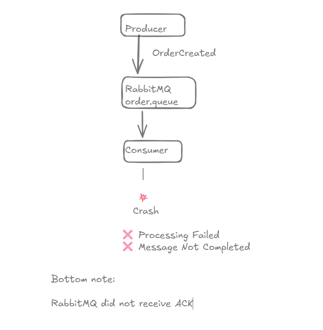
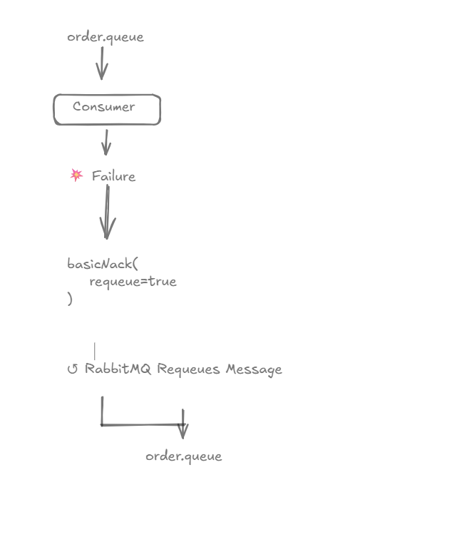
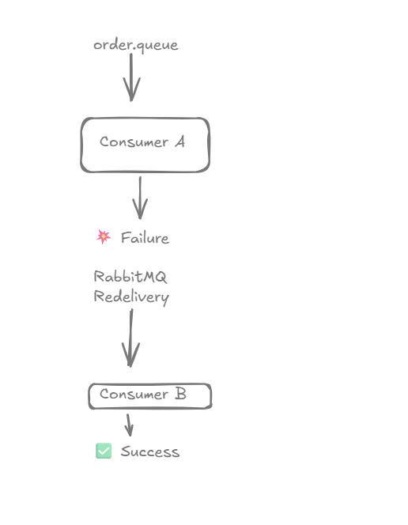
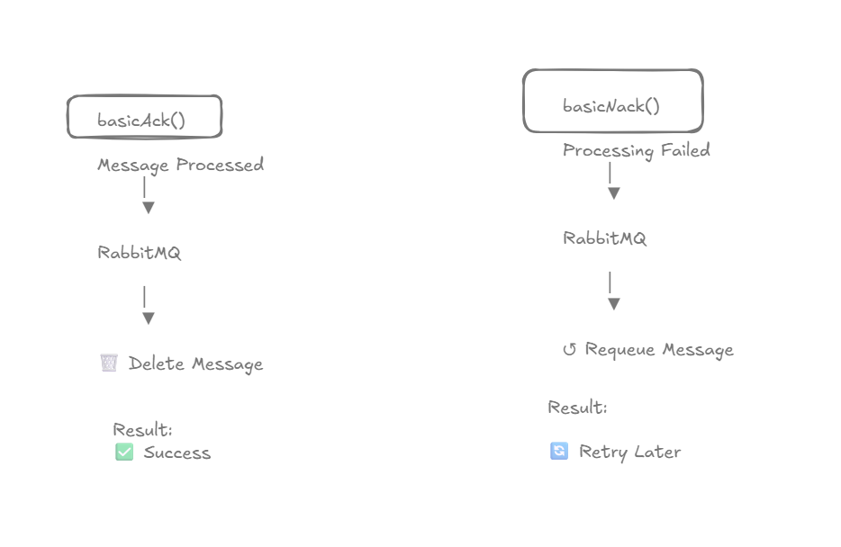
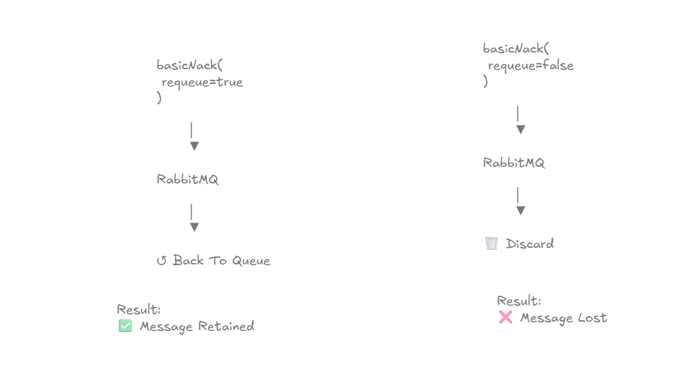
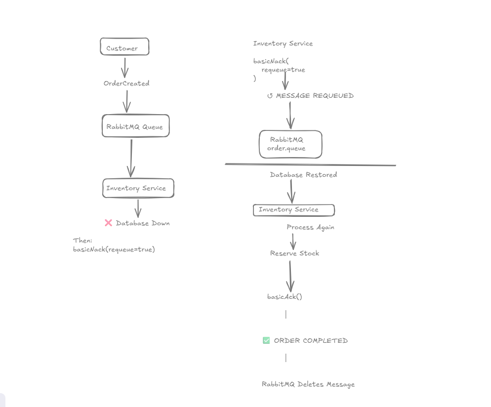
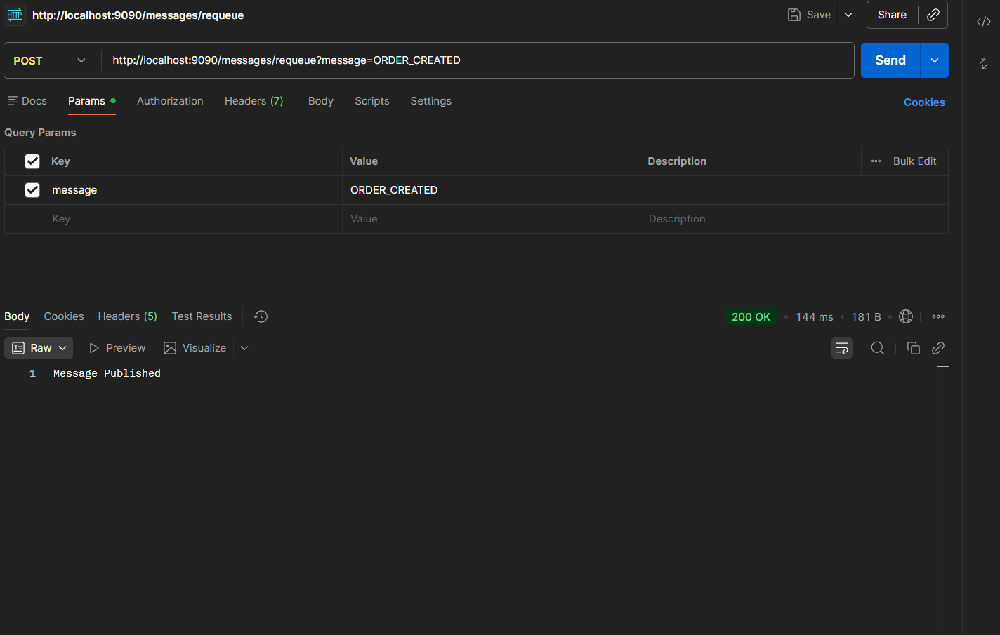
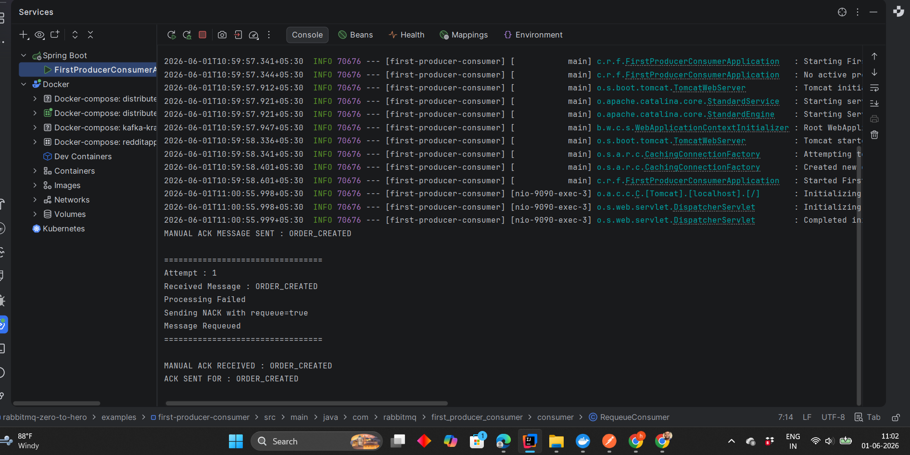

# Message Requeue & Redelivery

## Learning Objectives

After completing this chapter, you will understand:

- What Message Requeue is
- What Message Redelivery is
- Why RabbitMQ requeues failed messages
- How `basicNack()` works
- Difference between ACK and NACK
- The role of `requeue=true`
- Failure recovery in RabbitMQ
- Production-grade message handling patterns

---

# Why Requeue Exists

Failures are inevitable in distributed systems.

Common examples:

- Database downtime
- Network failures
- Third-party API outages
- Service crashes
- Infrastructure issues

Imagine an e-commerce system:

```text
OrderCreated
      ↓
Inventory Service
      ↓
Database Down
```

Without RabbitMQ requeue:

```text
❌ Order Lost
❌ Inventory Not Updated
❌ Inconsistent System State
```

With RabbitMQ requeue:

```text
OrderCreated
      ↓
Failure
      ↓
Message Requeued
      ↓
Retry Later
      ↓
Order Processed Successfully
```

This is one of RabbitMQ's most important reliability features.

---

# Consumer Failure Overview



Flow:

```text
Producer
    ↓
Queue
    ↓
Consumer
    ↓
Crash
```

The consumer receives the message but fails before completing processing.

RabbitMQ does not receive a successful acknowledgement.

---

# Message Requeue Flow



Flow:

```text
Queue
   ↓
Consumer
   ↓
Failure
   ↓
basicNack(requeue=true)
   ↓
Queue Again
```

RabbitMQ places the message back into the queue.

---

# Message Redelivery



Flow:

```text
Queue
   ↓
Consumer #1
   ↓
Failure
   ↓
RabbitMQ
   ↓
Consumer #2
```

RabbitMQ delivers the same message again.

This process is called:

```text
Message Redelivery
```

---

# ACK vs NACK



## ACK

```java
channel.basicAck(
        deliveryTag,
        false
);
```

Result:

```text
Message Successfully Processed
        ↓
RabbitMQ Deletes Message
```

---

## NACK

```java
channel.basicNack(
        deliveryTag,
        false,
        true
);
```

Result:

```text
Message Processing Failed
        ↓
RabbitMQ Requeues Message
```

---

# Requeue True vs False



## requeue=true

```java
channel.basicNack(
        deliveryTag,
        false,
        true
);
```

Result:

```text
Message Returned To Queue
```

---

## requeue=false

```java
channel.basicNack(
        deliveryTag,
        false,
        false
);
```

Result:

```text
Message Discarded
```

---

# Real World Example



Scenario:

```text
Customer Places Order
       ↓
OrderCreated Event
       ↓
RabbitMQ Queue
       ↓
Inventory Service
       ↓
Database Down
```

Inventory Service cannot process the order.

Instead of losing the event:

```java
channel.basicNack(
        deliveryTag,
        false,
        true
);
```

RabbitMQ safely returns the message to the queue.

Later:

```text
Database Restored
       ↓
Message Redelivered
       ↓
Inventory Updated
       ↓
basicAck()
       ↓
Success
```

This prevents order loss and ensures system consistency.

---

# Practical Implementation

In this chapter we reused:

```text
manual-ack.queue
```

from Chapter 15.

The consumer intentionally simulates a failure and sends a NACK.

---

# Endpoint

```http
POST /messages/requeue?message=ORDER_CREATED
```

This publishes a message that will be processed by the requeue consumer.

---

# Publishing Message



The producer successfully publishes:

```text
ORDER_CREATED
```

to RabbitMQ.

---

# Consumer Failure Demonstration

The consumer intentionally fails processing.

---

## Verification



Output:

```text
Attempt : 1

Received Message : ORDER_CREATED

Processing Failed

Sending NACK with requeue=true

Message Requeued
```

This confirms:

```text
Consumer Failure
       ↓
NACK
       ↓
RabbitMQ Requeues Message
```

---

# Requeue Consumer Implementation

Core logic:

```java
channel.basicNack(
        deliveryTag,
        false,
        true
);
```

Parameter breakdown:

| Parameter | Value | Meaning |
|------------|--------|----------|
| deliveryTag | Message ID | Message being processed |
| false | Single Message | Do not process multiple messages |
| true | Requeue | Return message to queue |

---

# Why Requeue Matters

Without requeue:

```text
Failure
   ↓
Message Lost
```

With requeue:

```text
Failure
   ↓
Message Stored Safely
   ↓
Retry Later
```

This enables resilient systems.

---

# Production Use Cases

## E-Commerce

```text
OrderCreated
```

Inventory Service unavailable:

```text
Message Requeued
```

---

## Banking

```text
MoneyTransferred
```

Database unavailable:

```text
Message Requeued
```

---

## Notifications

```text
EmailRequested
```

SMTP Server unavailable:

```text
Message Requeued
```

---

# Production Best Practices

## Requeue Temporary Failures

Examples:

- Database downtime
- Network interruption
- Service restart

---

## Avoid Infinite Retries

Unlimited retries can create:

```text
Retry Storms
```

Always use:

- Retry limits
- Dead Letter Queues
- Monitoring

---

## Monitor Requeued Messages

Large requeue counts often indicate:

- Database issues
- External dependency failures
- Infrastructure problems

---

## Prefer Explicit Failure Handling

Always use:

```java
basicAck()
```

or

```java
basicNack()
```

instead of silently ignoring failures.

---

# Interview Questions

1. What is Message Requeue?
2. What is Message Redelivery?
3. What is `basicNack()`?
4. What is the difference between ACK and NACK?
5. What does `requeue=true` do?
6. What does `requeue=false` do?
7. Why is requeue important?
8. What problems can unlimited retries create?
9. How does RabbitMQ recover from consumer failures?
10. Explain the complete requeue lifecycle.

---

# Key Takeaways

- Failures are normal in distributed systems.
- RabbitMQ supports message requeue and redelivery.
- `basicAck()` indicates success.
- `basicNack()` indicates failure.
- `requeue=true` returns messages to the queue.
- Requeue prevents message loss.
- Proper failure handling is critical in production systems.

---

# Chapter Summary

In this chapter, we explored RabbitMQ's failure recovery mechanism.

We learned:

- Consumer Failures
- Message Requeue
- Message Redelivery
- ACK vs NACK
- Failure Recovery Patterns

Most importantly:

```text
Consumer Failure
        ↓
basicNack()
        ↓
RabbitMQ Requeue
        ↓
Message Redelivery
        ↓
Successful Processing
```

This reliability mechanism is one of the primary reasons RabbitMQ is trusted in production environments.

---

# What's Next?

## Chapter 17 → Dead Letter Exchanges (DLX)

Topics Covered:

- Dead Letter Exchanges
- Dead Letter Queues
- Poison Messages
- Retry Limits
- Failure Isolation
- Enterprise Failure Handling Patterns

In the next chapter, we will build production-grade failure recovery using Dead Letter Exchanges and Dead Letter Queues.