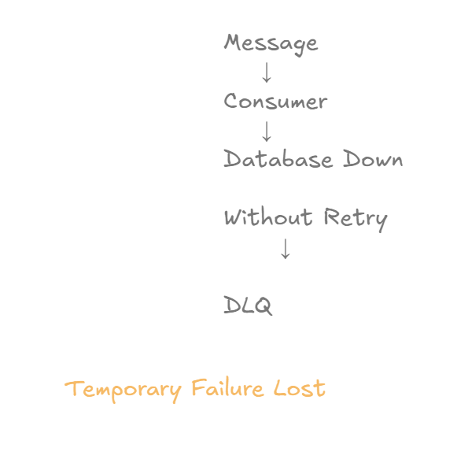
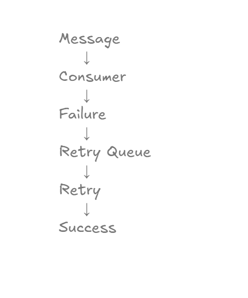
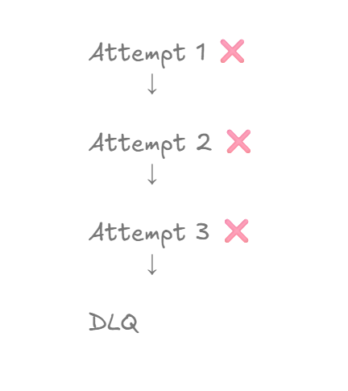
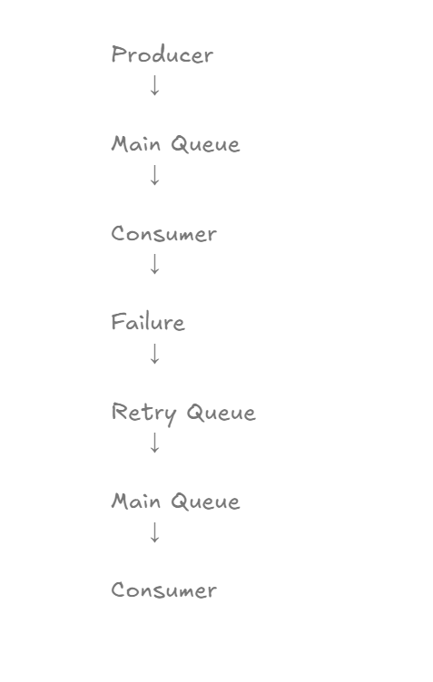
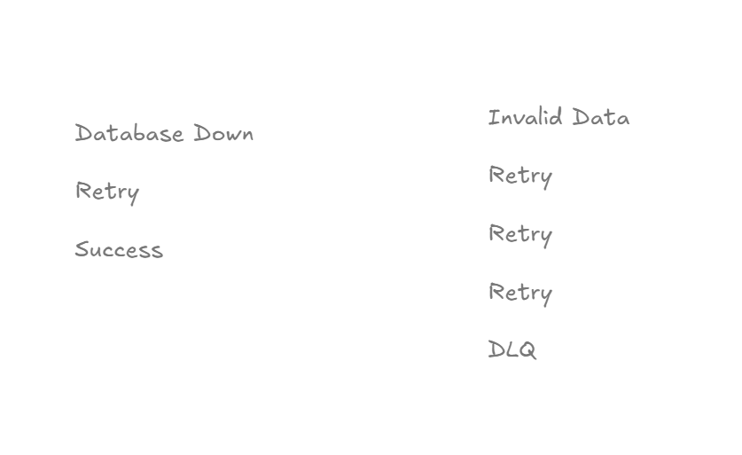
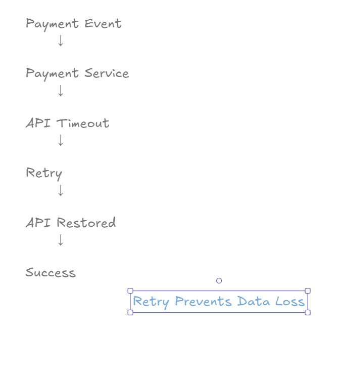

# Retry Mechanisms

## Learning Objectives

After completing this chapter, you will understand:

* Why retry mechanisms are needed
* Temporary vs permanent failures
* Retry Queues
* Retry Limits
* Retry Lifecycle
* Retry + DLQ Integration
* Production Retry Strategies
* Failure Recovery Patterns

---

# Why Retry Mechanisms Exist

In real-world systems, not every failure is permanent.

Consider the following scenario:

```text
OrderCreated Event
        ↓
Consumer
        ↓
Database Down
```

Should we immediately move the message to the Dead Letter Queue?

The answer is:

```text
No
```

Many failures are temporary:

* Database downtime
* Network timeout
* External API unavailable
* Cache server outage
* Service restart

These problems often resolve themselves after a short period.

A retry mechanism gives the system another chance to process the message successfully.

---

# The Problem Without Retries

Without retries, the flow looks like:

```text
Message
    ↓
Consumer
    ↓
Failure
    ↓
DLQ
```

This creates unnecessary message failures.

A temporary outage can cause valid business events to be moved directly to the Dead Letter Queue.

---

# Why Retries Are Needed



Consider:

```text
Database Down
```

Without retries:

```text
Failure
   ↓
DLQ
```

Result:

```text
Temporary Failure Lost
```

This is inefficient and creates unnecessary operational work.

---

# Retry Overview



With retries:

```text
Message
    ↓
Consumer
    ↓
Failure
    ↓
Retry Queue
    ↓
Retry
    ↓
Success
```

The message gets another opportunity to be processed successfully.

---

# Retry Then DLQ



A production system should never retry forever.

Example:

```text
Attempt 1 ❌
Attempt 2 ❌
Attempt 3 ❌
```

After the retry limit is exceeded:

```text
DLQ
```

This prevents endless processing loops.

---

# Retry Lifecycle



Complete flow:

```text
Producer
    ↓
Main Queue
    ↓
Consumer
    ↓
Failure
    ↓
Retry Queue
    ↓
Main Queue
    ↓
Consumer
```

The message continuously cycles until:

```text
Success
```

or

```text
Retry Limit Reached
```

---

# Transient vs Permanent Failures



Understanding the difference between failure types is critical.

---

## Transient Failure

Examples:

```text
Database Down
API Timeout
Network Issue
Service Restart
```

These failures are temporary.

Flow:

```text
Failure
   ↓
Retry
   ↓
Success
```

Retries are extremely useful here.

---

## Permanent Failure

Examples:

```text
Invalid JSON
Corrupted Data
Missing Required Fields
Invalid Business Rules
```

Flow:

```text
Failure
   ↓
Retry
   ↓
Retry
   ↓
Retry
   ↓
DLQ
```

Retries cannot fix invalid data.

The message should eventually move to the Dead Letter Queue.

---

# Real World Example



Imagine a payment service.

Event:

```text
PaymentCompleted
```

Consumer calls:

```text
External Payment API
```

Unfortunately:

```text
API Timeout
```

Without retries:

```text
Message Lost
```

With retries:

```text
Retry
   ↓
API Restored
   ↓
Success
```

Result:

```text
Retry Prevents Data Loss
```

---

# Architecture Used In This Chapter

The implementation uses:

```text
Main Queue
Retry Queue
Dead Letter Queue
```

Architecture:

```text
Producer
    ↓

order.queue
    ↓

Consumer
    ↓

Failure
    ↓

retry.queue
    ↓

order.queue
    ↓

Retry
    ↓

Failure
    ↓

retry.queue
    ↓

order.queue
    ↓

Retry
    ↓

Failure
    ↓

dead-letter.queue
```

This architecture is widely used in enterprise messaging systems.

---

# Retry Queue

The Retry Queue temporarily stores failed messages.

Purpose:

```text
Wait Before Retry
```

Benefits:

* Prevents immediate reprocessing
* Reduces pressure on dependent systems
* Allows temporary failures to recover

---

# Retry Count

Every retry increases the attempt count.

Example:

```text
Attempt 1
Attempt 2
Attempt 3
```

After reaching the configured threshold:

```text
Move To DLQ
```

This prevents infinite retry loops.

---

# Dead Letter Queue Integration

Retries and DLQ work together.

Flow:

```text
Failure
   ↓
Retry
   ↓
Retry
   ↓
Retry
   ↓
DLQ
```

The DLQ becomes the final destination for permanently failing messages.

---

# Retry Strategy

A common production strategy:

```text
Attempt 1
    ↓
Wait 10 Seconds

Attempt 2
    ↓
Wait 30 Seconds

Attempt 3
    ↓
Wait 60 Seconds

Move To DLQ
```

This is known as:

```text
Progressive Retry
```

or

```text
Backoff Strategy
```

---

# Why Infinite Retries Are Dangerous

Infinite retries can create:

```text
Queue Congestion
High CPU Usage
High Memory Usage
System Instability
```

A retry limit is always recommended.

---

# Production Best Practices

## Retry Only Temporary Failures

Good candidates:

```text
Database Connection Issues
Network Problems
External API Timeouts
Service Restarts
```

---

## Avoid Retrying Invalid Data

Bad candidates:

```text
Malformed JSON
Missing Required Fields
Invalid Business Logic
```

These should go directly to the DLQ.

---

## Always Use Retry Limits

Never allow endless retry loops.

---

## Combine Retries With DLQ

Recommended architecture:

```text
Retry Queue
      +
DLQ
```

---

## Monitor Retry Volume

High retry rates often indicate:

```text
Database Problems
Network Issues
External Service Failures
```

Monitoring retries helps detect system health issues.

---

# Retry vs Requeue

Many developers confuse these concepts.

---

## Requeue

```text
Failure
   ↓
Immediately Back To Queue
```

No delay.

May cause retry storms.

---

## Retry Queue

```text
Failure
   ↓
Retry Queue
   ↓
Delay
   ↓
Main Queue
```

Controlled retry behavior.

Preferred in production.

---

# Interview Questions

1. Why do we need retry mechanisms?
2. What is a Retry Queue?
3. What is the difference between Retry and Requeue?
4. Why should retries have limits?
5. What is a transient failure?
6. What is a permanent failure?
7. Why integrate retries with DLQ?
8. What is exponential backoff?
9. Why are infinite retries dangerous?
10. What failures should be retried?

---

# Key Takeaways

* Not every failure is permanent.
* Retry mechanisms improve reliability.
* Retry Queues allow delayed reprocessing.
* Retry limits prevent infinite loops.
* Temporary failures benefit from retries.
* Permanent failures belong in the DLQ.
* Retry + DLQ is a common production pattern.
* Retries reduce unnecessary message loss.

---

# Chapter Summary

In this chapter, we implemented:

```text
Retry Queue
      +
Retry Count
      +
DLQ Integration
```

We learned:

* Retry Mechanisms
* Retry Lifecycle
* Retry Limits
* Temporary vs Permanent Failures
* Retry Queue Architecture
* Production Reliability Patterns

Final Flow:

```text
Producer
    ↓
Queue
    ↓
Consumer
    ↓
Failure
    ↓
Retry
    ↓
Retry
    ↓
Retry
    ↓
DLQ
```

This completes the RabbitMQ reliability journey and demonstrates how modern distributed systems handle failures safely and efficiently.

---

# RabbitMQ Zero To Hero Journey Completed

Across the repository, we covered:

```text
RabbitMQ Fundamentals
Queues
Exchanges
Bindings
Routing Keys
Direct Exchange
Fanout Exchange
Topic Exchange
Headers Exchange

Acknowledgements
Manual ACK
NACK
Requeue

Dead Letter Exchange
Dead Letter Queue

Publisher Confirms

Durable Messaging
Persistent Messages

Retry Mechanisms
```

Together, these concepts form the foundation of production-grade RabbitMQ systems.
